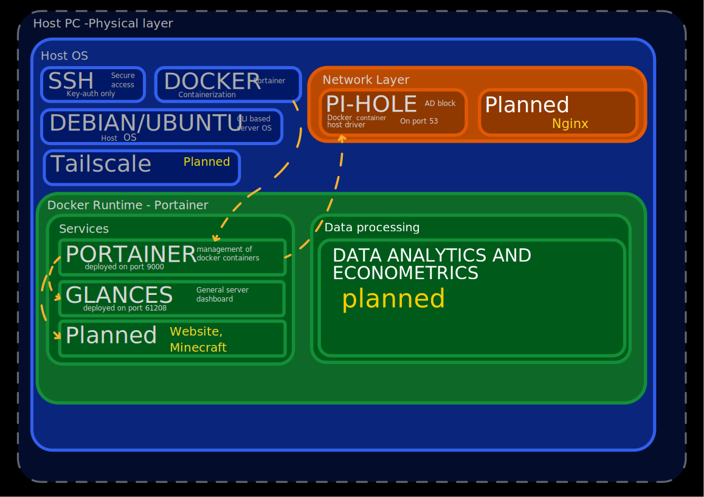
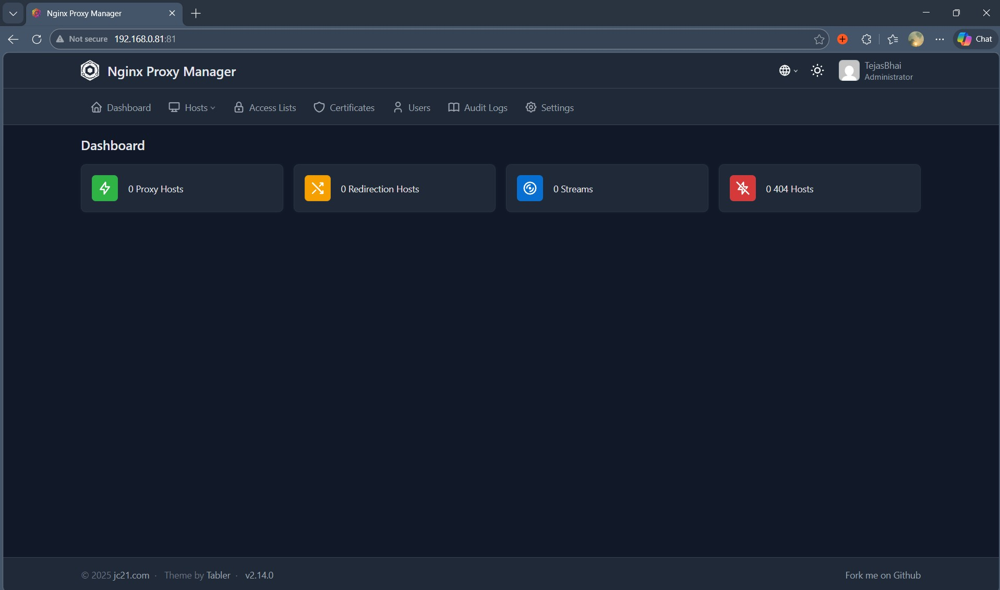

# Daily progress 

## 8 March '26
- cleaned laptop and removed keyboard for extra air flow and lower temps
- disabled sleep and turned off the display
- Install Ubuntu server
- setup SSH
- - created private key
  - saved the key for backups at /Documets/SSH-keys
    
## 9 March '26
- Installed docker
- Installed portainer for docker management
- configured to automatically start containers
- First software deployed: Glance, managed in a docker container
  
## 10 March '26
- cleaned up Github repo
### In progress
- Deployed piHole, facing networking problems -- to be continued
## 11 March '26
- Fully deployed Pi-hole and resolved netowrking issues
  
  ### Problem
  Pihole docker unable to receive queries from home network.
  ### Fix
  Changed the docker driver to Host from Bridge, now the container directly runs on host ip.
  ### what I learnt
  Docker bridge mode create a vitual ip addres in a internal network, which is seperate from the host's network thus, it rejects queries in the host network.
  Host mode makes the container run on host's IP that is 192.168.0.81 on port 53 bypassing the issue of different networks.

## 13 March '26
- Set up proper network documentation 

- created a system architecture diagram in affinity studio.

## 15 March '26
### In progress
- deployment of nginx proxy manager.
- deployment goaccess.

## 16 March '26

### Problems
- Pi hole and nginx use the same ports thus leading to a conflict.

## 17 March '26
- Attempted to resolve the conflict and reinstalled pihole several times to change its web port from 80 to 8053, however faced problems.

## 18 March '26
- Deleted portainer containers and tried to recreate with docker compose.
- while deleting, an error occured regarding filesystem.
- unable to delete the broken file link, tried to manualy delete the file.
- A fatal error occured breaking the kernal and the OS.
- Server became unstable.
